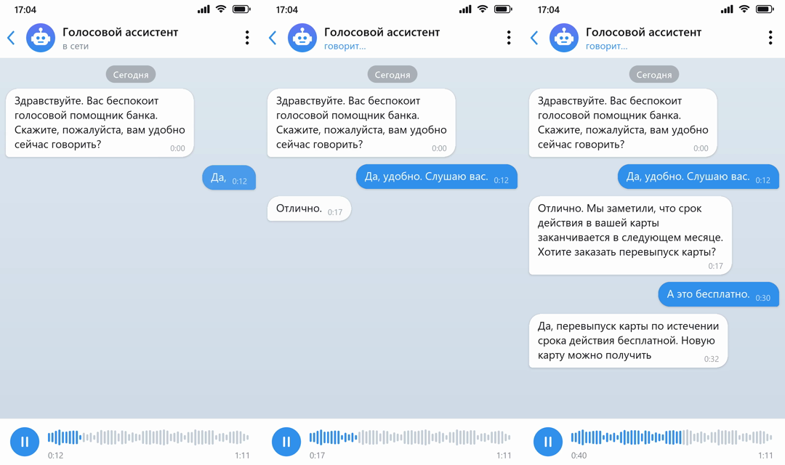

# Аудио → видео-чат

Локальный инструмент: из аудиозаписи разговора клиента с голосовым роботом делает вертикальное видео
(как запись экрана смартфона) с перепиской в мессенджере. Реплики робота слева, клиента справа;
они появляются синхронно со звуком, а сама запись звучит в видео.



## Как пользоваться

1. Запустите **`start.bat`**. Откроется браузер с интерфейсом. Окно консоли не закрывайте, пока работаете.
2. Перетащите аудиофайл (WAV, MP3, OGG, M4A, FLAC, AMR и т. д.), выберите модель и нажмите **«Распознать»**.
   Длинные фразы автоматически делятся на несколько баблов по предложениям
   (по умолчанию до ~200 символов в бабле; лимит выбирается там же, можно отключить).
3. Проверьте расшифровку. Каждая карточка — один бабл в чате. Для каждого бабла можно:
   - исправить текст;
   - переключить говорящего (🤖 Робот / 👤 Клиент) или поменять роли у всех баблов сразу;
   - поправить время начала и конца (кнопка ◷ берёт текущее время плеера, ▶ проигрывает бабл);
   - **✂ Разделить** на два по курсору (или Ctrl+Enter), **⤓ Объединить со следующим**;
   - **＋ Бабл ниже** — вставить новый бабл после текущего, **✕ Удалить** — убрать бабл.

   Кнопка **«＋ Добавить бабл»** вверху вставляет бабл в момент, на котором стоит плеер.
   **«✂ Разбить длинные»** заново делит все длинные баблы по предложениям (удобно после правок текста).

   Справа выбираются имя робота, тема (светлая, тёмная или зелёная), разрешение и способ появления текста,
   там же предпросмотр кадра. Правки сохраняются автоматически.
4. Нажмите **«Далее: создать видео»**, дождитесь окончания и нажмите **«Скачать MP4»**.

Недавние записи показаны на главном экране, к ним можно вернуться и поправить видео.
Рабочие файлы хранятся в папке `workspace` и удаляются через 14 дней.

## Требования

- Windows 10/11 и **Python 3.9–3.13** ([python.org](https://www.python.org/downloads/), при установке отметьте
  «Add python.exe to PATH»).
- При первом запуске нужен интернет: `start.bat` создаёт окружение `venv` и ставит библиотеки,
  а при первом распознавании скачивается модель (small около 0,5 ГБ). Во время скачивания видно,
  сколько уже скачано, скорость и оставшееся время. Если соединение не устанавливается или
  обрывается, появится предупреждение, а скачивание до трёх раз продолжится с места обрыва.
  Под выбором модели видно, скачана ли она уже. После этого всё работает **без интернета**.
- Модели скачиваются обычным HTTPS с `huggingface.co` (протокол Xet отключён), поэтому прокси
  достаточно пропускать этот адрес и `cdn-lfs*.huggingface.co`.
- Видеокарта не нужна: распознавание идёт на процессоре.

Используются только распространённые библиотеки из PyPI: `flask`, `faster-whisper` (Whisper от OpenAI),
`numpy`, `pillow`, `imageio-ffmpeg` (готовый ffmpeg для кодирования видео).

## Если на рабочем месте нет интернета

**Вариант 1: офлайн-комплект.** На любом компьютере с интернетом и **той же версией Python**:

1. Запустите `start.bat` один раз, затем закройте его окно.
2. Запустите `prepare_offline.bat`: он скачает библиотеки в папку `wheels` и модель в папку `models`
   (прогресс скачивания модели показывается в консоли).
3. Скопируйте папку проекта на рабочее место (без `venv` и `workspace`) и запустите там `start.bat`.
   Библиотеки установятся из `wheels`, интернет не понадобится.

**Вариант 2: только модель вручную.** Если библиотеки ставятся (например, через корпоративное зеркало PyPI),
а huggingface.co закрыт, скачайте файлы модели на другом компьютере и положите их в папку
`models\<имя модели>\` внутри папки инструмента. Нужны только перечисленные файлы, `README.md` и
`.gitattributes` из репозитория не нужны. Имена файлов менять нельзя.

```
audio-to-video\
  models\
    small\
      config.json
      model.bin
      tokenizer.json
      vocabulary.txt
```

| Модель | Папка | Размер | Файлы (прямые ссылки) |
|---|---|---|---|
| small | `models\small\` | ~465 МБ | [config.json](https://huggingface.co/Systran/faster-whisper-small/resolve/main/config.json?download=true), [model.bin](https://huggingface.co/Systran/faster-whisper-small/resolve/main/model.bin?download=true), [tokenizer.json](https://huggingface.co/Systran/faster-whisper-small/resolve/main/tokenizer.json?download=true), [vocabulary.txt](https://huggingface.co/Systran/faster-whisper-small/resolve/main/vocabulary.txt?download=true) |
| medium | `models\medium\` | ~1,5 ГБ | [config.json](https://huggingface.co/Systran/faster-whisper-medium/resolve/main/config.json?download=true), [model.bin](https://huggingface.co/Systran/faster-whisper-medium/resolve/main/model.bin?download=true), [tokenizer.json](https://huggingface.co/Systran/faster-whisper-medium/resolve/main/tokenizer.json?download=true), [vocabulary.txt](https://huggingface.co/Systran/faster-whisper-medium/resolve/main/vocabulary.txt?download=true) |
| large-v3-turbo | `models\large-v3-turbo\` | ~1,6 ГБ | [config.json](https://huggingface.co/mobiuslabsgmbh/faster-whisper-large-v3-turbo/resolve/main/config.json?download=true), [model.bin](https://huggingface.co/mobiuslabsgmbh/faster-whisper-large-v3-turbo/resolve/main/model.bin?download=true), [preprocessor_config.json](https://huggingface.co/mobiuslabsgmbh/faster-whisper-large-v3-turbo/resolve/main/preprocessor_config.json?download=true), [tokenizer.json](https://huggingface.co/mobiuslabsgmbh/faster-whisper-large-v3-turbo/resolve/main/tokenizer.json?download=true), [vocabulary.json](https://huggingface.co/mobiuslabsgmbh/faster-whisper-large-v3-turbo/resolve/main/vocabulary.json?download=true) |
| large-v3 | `models\large-v3\` | ~3 ГБ | [config.json](https://huggingface.co/Systran/faster-whisper-large-v3/resolve/main/config.json?download=true), [model.bin](https://huggingface.co/Systran/faster-whisper-large-v3/resolve/main/model.bin?download=true), [preprocessor_config.json](https://huggingface.co/Systran/faster-whisper-large-v3/resolve/main/preprocessor_config.json?download=true), [tokenizer.json](https://huggingface.co/Systran/faster-whisper-large-v3/resolve/main/tokenizer.json?download=true), [vocabulary.json](https://huggingface.co/Systran/faster-whisper-large-v3/resolve/main/vocabulary.json?download=true) |

Все файлы модели одной страницей: `https://huggingface.co/<репозиторий>/tree/main`, например
<https://huggingface.co/Systran/faster-whisper-small/tree/main>.
У large-моделей обязателен `preprocessor_config.json`, а словарь называется `vocabulary.json`.

Положенная вручную модель имеет приоритет над скачанной автоматически. После перезапуска
`start.bat` она отмечается в списке как «✓ скачана».

Если pip работает через прокси, задайте его перед запуском, например `set HTTPS_PROXY=http://proxy:3128`,
или в `%APPDATA%\pip\pip.ini`.

## Как определяется, кто говорит

- **Стереозапись** (робот и клиент в разных каналах, обычная запись телефонии): каждый канал
  распознаётся отдельно. Это самый точный вариант.
- **Моно**: фразы делятся по паузам. По длинным фразам строятся модели двух голосов (тембр, MFCC),
  затем каждая фраза, включая короткие («Да», «Алло»), относится к более похожему голосу.
  Собеседник не может смениться посреди предложения: такие ошибки распознавания исправляются автоматически.
- Роботом считается собеседник, который суммарно говорит дольше. Если вышло наоборот, нажмите
  «⇄ Поменять роли».

## Модели распознавания

| Модель | Размер | Скорость на CPU | Качество для русского |
|---|---|---|---|
| small | ~0,5 ГБ | быстро | среднее |
| medium | ~1,5 ГБ | медленнее | хорошее |
| large-v3-turbo | ~1,6 ГБ | умеренно | хорошее |
| large-v3 | ~3 ГБ | медленно | лучшее |

Если в расшифровке много ошибок, попробуйте `large-v3-turbo`.

## Структура

```
start.bat              запуск (создание окружения, установка библиотек, старт сервера)
prepare_offline.bat    подготовка офлайн-комплекта
app/server.py          локальный веб-сервер (Flask), http://127.0.0.1:8765
app/transcriber.py     распознавание (faster-whisper) и разбивка на реплики
app/diarization.py     разделение говорящих в моно-записи
app/segmenter.py       деление длинных фраз на баблы по предложениям
app/renderer.py        отрисовка экрана чата (Pillow) и кодирование MP4 (ffmpeg)
app/static/            веб-интерфейс (без внешних зависимостей)
```
